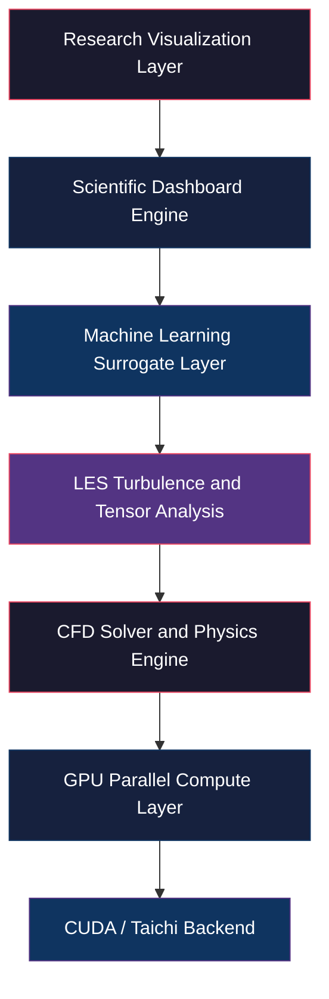
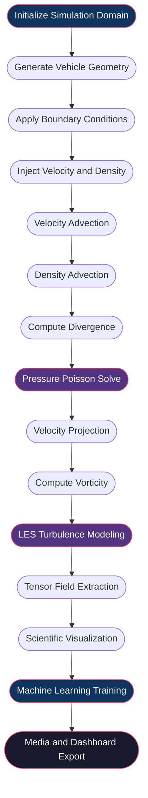
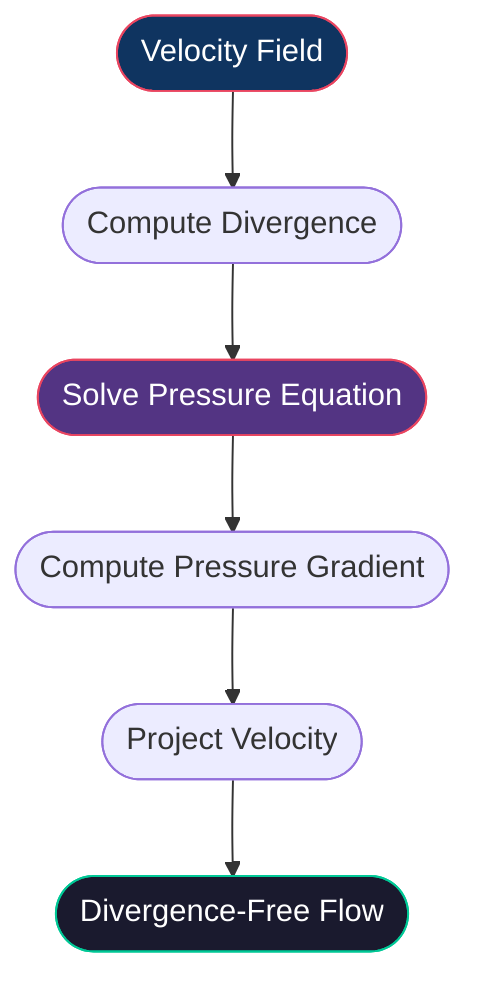
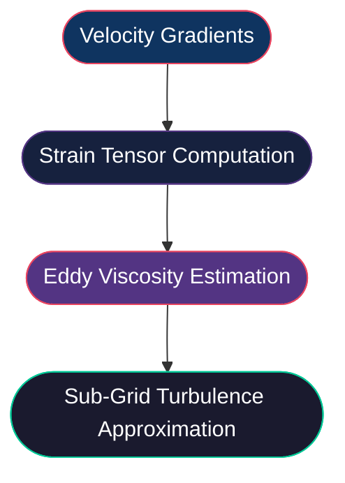
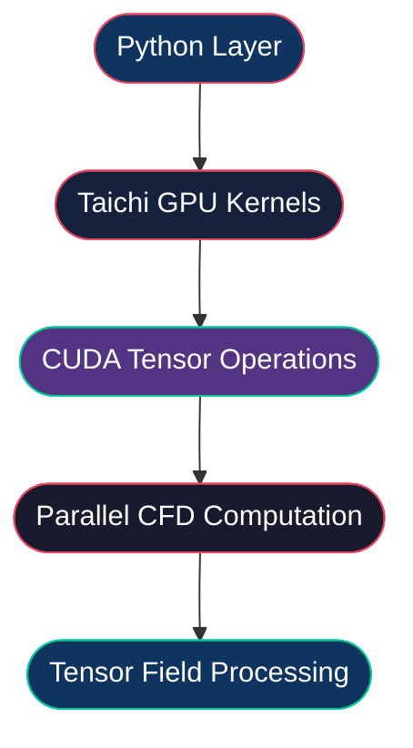
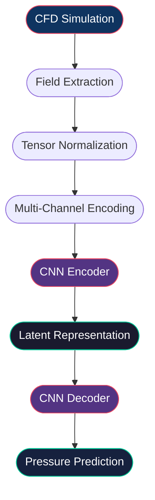

# GPU Accelerated CFD, LES, and Physics-Informed ML Research Framework

<p align="center">
High-Performance Computational Fluid Dynamics using GPU Parallelism, Large Eddy Simulation, Tensor-Field Analysis, and Machine Learning Surrogate Modeling
</p>

---

## Overview

This repository presents a research-oriented Computational Fluid Dynamics (CFD) framework developed for high-performance aerodynamic flow simulation, turbulence modeling, scientific visualization, and machine learning surrogate prediction.

The framework integrates:

- GPU-accelerated numerical computing
- Incompressible Navier–Stokes solvers
- Pressure-projection methods
- Large Eddy Simulation (LES)
- Tensor-field analysis
- Vorticity-based turbulence enhancement
- Scientific dashboard generation
- Physics-informed machine learning

The project is implemented using Taichi Lang for massively parallel GPU kernels and PyTorch for neural-network-based pressure-field prediction.

The architecture is designed as a hybrid CFD + AI scientific-computing workflow capable of:
- aerodynamic wake analysis
- turbulence visualization
- pressure-field approximation
- GPU tensor computation
- CFD-to-ML dataset generation
- engineering visualization pipelines

---

# Project Goals

The primary objectives of this framework are:

## Computational Fluid Dynamics
- Simulate incompressible aerodynamic flow
- Model turbulent wake structures
- Visualize vortex formation and recirculation
- Study pressure and velocity evolution
- Generate stable divergence-free flow fields

---

## GPU Scientific Computing
- Accelerate CFD kernels using CUDA
- Parallelize pressure-projection solvers
- Optimize tensor-field operations
- Reduce CFD computational cost

---

## Turbulence Modeling
- Implement Large Eddy Simulation (LES)
- Compute strain and stress tensors
- Estimate sub-grid turbulence structures
- Visualize eddy viscosity distributions

---

## Scientific Visualization
- Generate research-grade CFD dashboards
- Render scalar and vector fields
- Visualize streamlines and wake dynamics
- Produce engineering-quality reports and animations

---

## Machine Learning Integration
- Train neural-network pressure surrogates
- Generate CFD-based datasets
- Explore reduced-order flow modeling
- Build physics-informed ML workflows

---

# System Architecture

The framework follows a modular scientific-computing architecture designed for scalability, GPU acceleration, and hybrid physics-ML integration.

---

# High-Level Architecture



---

# CFD Solver Architecture

The CFD engine is based on a pressure-projection formulation of the incompressible Navier-Stokes equations.

The simulation pipeline is decomposed into several GPU-parallel computational stages.

---

# Simulation Pipeline



---

# Numerical Methods

## Governing Equations

### Incompressible Navier-Stokes Equations

$$
\frac{\partial \mathbf{u}}{\partial t} + (\mathbf{u} \cdot \nabla)\mathbf{u} = -\nabla p + \nu \nabla^2 \mathbf{u}
$$

Where:

- $\mathbf{u}$ — velocity field
- $p$ — pressure field
- $\nu$ — kinematic viscosity

---

### Continuity Equation

$$
\nabla \cdot \mathbf{u} = 0
$$

The pressure-projection stage enforces incompressibility by removing divergence from the velocity field.

---

### Pressure Poisson Equation

$$
\nabla^2 p = \nabla \cdot \mathbf{u}
$$

The pressure field is solved iteratively using a GPU-accelerated Jacobi solver.

---

# Numerical Solver Components

## Semi-Lagrangian Advection

The framework uses semi-Lagrangian transport for:
- velocity advection
- scalar-density transport
- stable timestep integration

### Advantages
- unconditional stability
- efficient GPU implementation
- reduced numerical instability
- robust fluid transport

---

## Bilinear Interpolation

Bilinear interpolation is used during:
- velocity tracing
- density sampling
- advection reconstruction

This improves:
- flow smoothness
- numerical continuity
- scalar transport quality

---

## Pressure Projection

The projection stage removes divergence from the velocity field.

### Projection Pipeline



---

## Jacobi Pressure Solver

The pressure field is solved iteratively using a Jacobi-based Poisson solver.

### Responsibilities
- incompressibility enforcement
- pressure stabilization
- divergence elimination

### GPU Parallelization
All pressure iterations execute directly on GPU tensor fields using Taichi kernels.

---

# Turbulence Modeling Architecture

The framework integrates Large Eddy Simulation (LES) for sub-grid turbulence approximation.

---

# LES Pipeline



---

## Smagorinsky-Lilly LES Model

The eddy viscosity is computed using:

$$
\nu_t = (C_s \Delta)^2 \sqrt{2 S_{ij} S_{ij}}
$$

Where:
- $\nu_t$ — eddy viscosity
- $C_s$ — Smagorinsky constant
- $\Delta$ — filter width (grid scale)
- $S_{ij}$ — strain-rate tensor

---

# Tensor-Field Analysis

The framework computes several tensor-based fluid quantities.

---

# Computed Tensor Fields

| Tensor Field | Description |
|---|---|
| Velocity Tensor | Fluid transport dynamics |
| Pressure Tensor | Pressure distribution |
| Strain Tensor | Local deformation rates |
| Stress Tensor | Internal fluid stresses |
| Eddy Viscosity Tensor | LES turbulence approximation |

---

# Vorticity and Wake Dynamics

## Vorticity Computation

The framework computes rotational flow structures using:

$$
\boldsymbol{\omega} = \nabla \times \mathbf{u}
$$

Used for:
- wake analysis
- vortex visualization
- turbulence detection
- rotational-flow analysis

---

## Vorticity Confinement

Vorticity confinement restores small-scale turbulence lost through numerical dissipation.

### Benefits
- stronger vortex preservation
- improved wake sharpness
- enhanced turbulent structures

---

# GPU Computing Pipeline

The entire CFD workflow is optimized for CUDA-enabled GPU execution.

---

# GPU Architecture



---

# GPU-Accelerated Components

| Component | GPU Accelerated |
|---|---|
| Velocity Advection | Yes |
| Pressure Solve | Yes |
| Divergence Computation | Yes |
| LES Computation | Yes |
| Tensor Operations | Yes |
| Vorticity Transport | Yes |
| CNN Training | Yes |

---

# Machine Learning Architecture

The framework integrates a convolutional neural network (CNN) surrogate for pressure-field approximation.

---

# ML Objective

The neural network learns to approximate CFD pressure distributions directly from simulated flow features.

This enables:
- reduced-order modeling
- accelerated inference
- hybrid CFD-AI workflows
- physics-informed ML experimentation

---

# CFD-to-ML Pipeline



---

# Input Feature Channels

The neural network receives six CFD channels:

| Channel | Description |
|---|---|
| Velocity X | Horizontal velocity component |
| Velocity Y | Vertical velocity component |
| Pressure Field | Ground-truth pressure |
| Vorticity Field | Rotational-flow structures |
| Density Field | Smoke scalar transport |
| Obstacle Mask | Vehicle geometry encoding |

---

# CNN Architecture

## Encoder
Responsible for:
- local flow-feature extraction
- turbulence-pattern encoding
- latent-space generation

---

## Decoder
Responsible for:
- pressure reconstruction
- scalar-field prediction
- spatial-pressure approximation

---

# Optimization Pipeline

| Component | Method |
|---|---|
| Optimizer | Adam |
| Scheduler | Cosine Annealing |
| Loss Function | Mean Squared Error |
| ML Framework | PyTorch |

---

# Scientific Visualization System

The framework automatically generates scientific dashboards for flow analysis and engineering interpretation.

---

# Visualization Components

## Scalar Field Rendering
Visualized fields include:
- pressure
- velocity magnitude
- density transport
- LES viscosity
- turbulence intensity

---

## Streamline Visualization
Used for:
- aerodynamic wake analysis
- separation visualization
- recirculation tracking
- vortex analysis

---

## Tensor Visualization
Displays:
- strain magnitude
- stress magnitude
- turbulence-energy structures

---

# Dashboard Generation

The framework automatically exports:
- CFD dashboards
- ML comparison dashboards
- convergence plots
- publication-style figures
- engineering reports

---

# Technology Stack

| Category | Technology |
|---|---|
| Programming Language | Python 3 |
| GPU Framework | Taichi Lang |
| Deep Learning Framework | PyTorch |
| Numerical Computing | NumPy |
| Scientific Visualization | Matplotlib |
| Media Export | ImageIO |
| Runtime Monitoring | tqdm |
| Cloud Runtime | Google Colab |
| Notebook Environment | Jupyter |

---

# Repository Structure

```text
project/
|
|-- main.py
|-- notebook.ipynb
|-- requirements.txt
|-- README.md
|
|-- outputs/
|   |-- advanced_cfd.gif
|   |-- final_cfd_video.mp4
|   |-- cfd_dashboard.png
|   |-- cfd_research_dashboard.png
|   |-- cfd_ml_results.png
|   |-- streamlines.png
|   |-- pressure_field.png
|   |-- vorticity_field.png
|   |-- vector_field.png
|   |-- particle_flow.png
|   |-- vortex_flow_field.png
|   `-- cfd_report.txt
|
`-- models/
    `-- CFDNet
```

---

# Installation

## Clone Repository

```bash
git clone https://github.com/yourusername/gpu-cfd-les-framework.git
cd gpu-cfd-les-framework
```

---

## Install Dependencies

```bash
pip install taichi
pip install torch
pip install matplotlib
pip install imageio
pip install tqdm
pip install numpy
```

---

## Alternative Installation

```bash
pip install -r requirements.txt
```

---

# Running the Framework

## Local Execution

```bash
python main.py
```

---

## Google Colab Execution

1. Open the notebook in Google Colab
2. Enable GPU runtime
3. Execute all notebook cells sequentially

---

# Generated Outputs

## CFD Outputs
- pressure-field visualizations
- vorticity maps
- streamline renderings
- wake analysis dashboards
- smoke-density transport

---

## ML Outputs
- pressure-field predictions
- CNN convergence curves
- ML-vs-CFD comparisons

---

## Media Outputs
- GIF animations
- MP4 simulation videos
- scientific dashboards
- engineering reports

---

# Engineering Applications

This framework is suitable for:

- aerodynamic flow analysis
- turbulence modeling research
- GPU scientific computing
- CFD education
- scientific visualization
- physics-informed machine learning
- reduced-order flow modeling
- engineering simulation portfolios

---

# Current Limitations

- 2D simulation only
- simplified vehicle geometry
- no adaptive mesh refinement
- incompressible flow assumption
- no thermal-fluid coupling
- no multi-phase simulation

---

# Future Work

Potential future upgrades include:

- full 3D Navier-Stokes simulation
- adaptive mesh refinement
- Fourier Neural Operators
- Physics-Informed Neural Networks (PINNs)
- real-time OpenGL visualization
- OpenFOAM interoperability
- multi-GPU scaling
- lattice Boltzmann implementation

---

# License

Apache License 2.0

Copyright 2026

Licensed under the Apache License, Version 2.0 (the "License");
you may not use this project except in compliance with the License.

You may obtain a copy of the License at:

http://www.apache.org/licenses/LICENSE-2.0

Unless required by applicable law or agreed to in writing, software distributed under the License is distributed on an "AS IS" BASIS, WITHOUT WARRANTIES OR CONDITIONS OF ANY KIND, either express or implied.

See the License for the specific language governing permissions and limitations under the License.

---

# References

## Computational Fluid Dynamics
- Computational Fluid Dynamics — John D. Anderson
- Numerical Heat Transfer and Fluid Flow — Suhas Patankar

---

## GPU Computing
- Taichi Lang Documentation
- NVIDIA CUDA Programming Guide

---

## Machine Learning
- PyTorch Documentation
- Deep Learning — Goodfellow, Bengio, Courville

---

## Turbulence Modeling
- Large Eddy Simulation literature
- Smagorinsky turbulence-model research papers

---

# Acknowledgements

This framework utilizes:
- Taichi Lang for GPU kernel acceleration
- PyTorch for machine learning workflows
- NumPy for scientific tensor computation
- Matplotlib for visualization and dashboard generation
- CUDA-enabled GPUs for high-performance CFD acceleration

---

# Conclusion

This project demonstrates the integration of GPU-accelerated Computational Fluid Dynamics, turbulence modeling, tensor-field analysis, and machine learning into a unified scientific-computing architecture.

The framework serves as:
- a CFD research platform
- a GPU scientific-computing workflow
- a turbulence-visualization environment
- a physics-informed ML experimentation system
- an engineering simulation portfolio project

By combining classical numerical fluid mechanics with modern AI-based surrogate modeling, the project explores scalable approaches for next-generation scientific computing and accelerated aerodynamic simulation.
